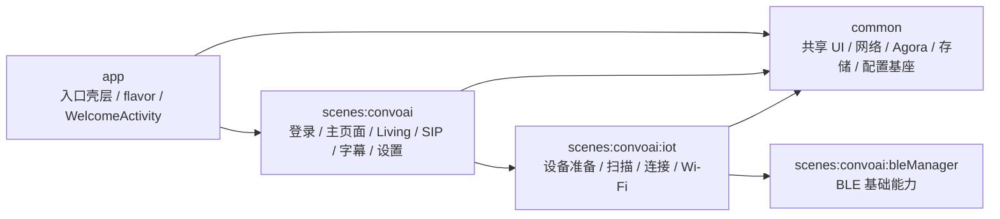
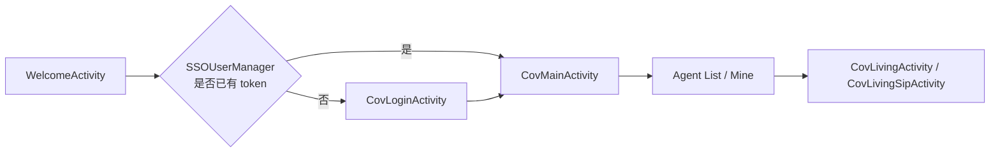
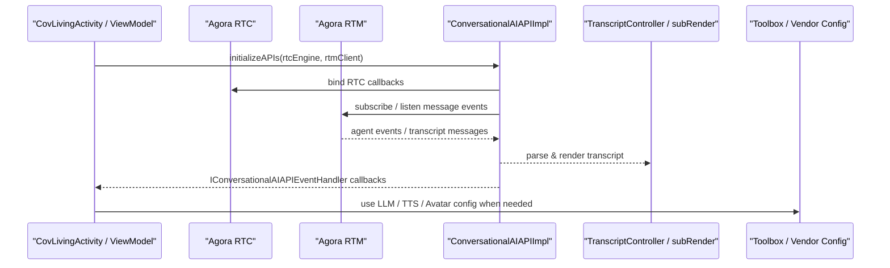
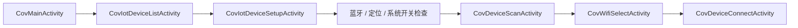
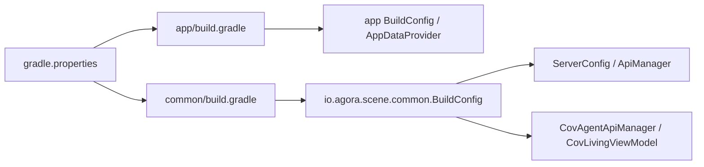

# ARCHITECTURE.md

本文档描述当前 Android 工程的全局架构，面向两类读者：

- 新接手项目的开发者
- 需要快速建立仓库心智模型的 AI Agent

本文档关注“模块关系、主链路、配置注入、外部依赖、高风险区域”。
运行步骤、组件接入细节、workflow 协作规则分别看对应 README / AGENTS 文档。

## 1. 项目定位

这是一个 `Shengwang Convo AI Demo for Android`，核心目标是演示以下能力在 Android 端的组合接入：

- 对话式 AI 主场景
- Agora RTC / RTM 实时音视频与消息能力
- 字幕渲染与会话消息链路
- LLM / TTS / Avatar 厂商参数注入
- IoT / BLE 设备配网与连接

它是一个 Demo 工程，不应默认等同生产环境实现。

## 2. 模块关系

### 模块职责

| 模块 | 主要职责 | 备注 |
|---|---|---|
| `app` | 应用入口、启动页、flavor、签名、APK 命名、App 级 `BuildConfig` | 当前启动入口是 `WelcomeActivity` |
| `common` | 公共 UI 基类、调试能力、网络层、Agora 依赖、存储、通用工具 | 影响范围最大 |
| `scenes:convoai` | 登录、主页面、Living/SIP、Agent 列表、字幕、头像、设置等主业务 | 项目核心场景 |
| `scenes:convoai:iot` | 设备准备、权限检查、蓝牙/Wi-Fi 配网、设备列表与连接 | 依赖 `bleManager` |
| `scenes:convoai:bleManager` | BLE 基础能力 | 被 IoT 场景消费 |

### 关键包结构

- `common/src/main/java/io/agora/scene/common/ui`
- `common/src/main/java/io/agora/scene/common/net`
- `scenes/convoai/src/main/java/io/agora/scene/convoai/ui`
- `scenes/convoai/src/main/java/io/agora/scene/convoai/api`
- `scenes/convoai/src/main/java/io/agora/scene/convoai/rtc`
- `scenes/convoai/src/main/java/io/agora/scene/convoai/rtm`
- `scenes/convoai/src/main/java/io/agora/scene/convoai/convoaiApi`
- `scenes/convoai/iot/src/main/java/io/agora/scene/convoai/iot/ui`

## 3. 主链路

### 3.1 启动与登录链路

说明：

- `app` 只决定“从启动页进入登录还是主页面”
- 登录态检查由 `SSOUserManager` 与用户相关 ViewModel 协同完成
- 主页面使用 `ViewPager + BottomNavigation` 组织 Agent 列表与我的页面

### 3.2 对话式 AI 主链路

说明：

- `CovLivingViewModel` 中会创建 `ConversationalAIAPIImpl`，同时接入 RTC 与 RTM
- 消息、字幕、打断、指标、图片消息等都从 `IConversationalAIAPIEventHandler` 回到 UI 层
- `convoaiApi/subRender` 是字幕链路关键点，兼容性和包名结构都很敏感

### 3.3 IoT / BLE 链路

说明：

- IoT 链路依赖蓝牙、定位、Wi-Fi 与真机能力
- `CovIotDeviceSetupActivity` 是权限、蓝牙、定位、前置准备的关键入口
- 这条链路天然不适合只靠模拟器验证

## 4. 配置与依赖注入

### 4.1 配置源

项目的主要配置入口是根目录 `gradle.properties`，包括：

- `TOOLBOX_SERVER_HOST`
- `AG_APP_ID`
- `AG_APP_CERTIFICATE`
- `BASIC_AUTH_KEY` / `BASIC_AUTH_SECRET`
- `IS_OPEN_SOURCE`
- `LLM_*`
- `TTS_*`
- `AVATAR_*`

### 4.2 注入路径

说明：

- `app/build.gradle` 主要注入 App 级标识和 `TOOLBOX_SERVER_HOST`
- `common/build.gradle` 注入对话式 AI 场景所需的大多数厂商参数
- `scenes:convoai` 中的业务代码会直接 import `io.agora.scene.common.BuildConfig` 来消费这些配置
- `ServerConfig` 会把 toolbox 地址和 RTC 凭据推进到运行时网络层
- Living 场景会继续消费 LLM / TTS / Avatar 相关 `BuildConfig`

## 5. 外部依赖与系统能力

### 外部依赖

- Agora RTC
- Agora RTM
- toolbox server / agent 服务端
- LLM 厂商
- TTS 厂商
- Avatar 厂商

### 关键系统能力

- `INTERNET`
- `CAMERA`
- `RECORD_AUDIO`
- `FOREGROUND_SERVICE`
- `POST_NOTIFICATIONS`
- `READ_MEDIA_IMAGES`
- IoT 模块额外使用 `BLUETOOTH_*`、`ACCESS_FINE_LOCATION`、`ACCESS_COARSE_LOCATION`

## 6. 高风险区域

### 6.1 构建与配置

- `settings.gradle`
- 各模块 `build.gradle(.kts)`
- `gradle/libs.versions.toml`
- `gradle.properties`
- `AndroidManifest.xml`

原因：

- 直接影响 flavor、依赖版本、权限、签名、BuildConfig 注入和网络基址

### 6.2 `common`

原因：

- 它是共享底座，持有公共 UI、网络、Agora、工具类和大部分配置注入

### 6.3 `convoaiApi` 与字幕组件

路径：

- `scenes/convoai/src/main/java/io/agora/scene/convoai/convoaiApi/`
- `scenes/convoai/src/main/java/io/agora/scene/convoai/convoaiApi/subRender/`

原因：

- 同时连接 RTC、RTM、消息解析、字幕渲染和 UI 回调
- `README` 明确要求保持包名结构稳定
- 改动很容易影响字幕、消息、打断、指标和转录兼容性

### 6.4 IoT / BLE

原因：

- 强依赖权限、蓝牙、定位、Wi-Fi 和真机状态
- Android 版本差异对权限行为影响明显

### 6.5 混合语言级别

原因：

- `app/common/scenes:convoai` 使用 Java 17
- `scenes:convoai:iot` 和 `scenes:convoai:bleManager` 使用 Java 11
- 跨模块构建或语言级别调整时，容易带来编译与兼容性问题

## 7. 变更时的验证建议

- 改 `app`：验证启动链路、登录跳转、flavor 产物、Manifest 权限
- 改 `common`：验证网络、Agora 基础能力、BuildConfig 注入是否影响所有场景
- 改 `scenes:convoai`：验证登录、主页面、Living/SIP、字幕、Agent 列表与 Mine 页面
- 改 `convoaiApi/subRender`：验证 RTC/RTM、字幕更新、消息解析、回调派发、包名结构
- 改 `iot/bleManager`：至少覆盖权限申请、蓝牙开启、定位服务、扫描、连接、Wi-Fi 选择
- 改 `gradle.properties` 或构建脚本：验证配置是否正确进入 `BuildConfig`，并确认无敏感信息泄露

## 8. 推荐阅读顺序

1. `AGENTS.md`
2. `ARCHITECTURE.md`（本文）
3. `scenes/convoai/README.md`
4. `scenes/convoai/src/main/java/io/agora/scene/convoai/convoaiApi/README.md`

## 9. 文档边界

本文档不重复以下内容：

- workflow 协作、状态机和评审规则：看 `AGENTS.md`
- 运行前配置与快速开始：看 `scenes/convoai/README.md`
- `convoaiApi` 组件的接入细节：看 `convoaiApi/README.md`
